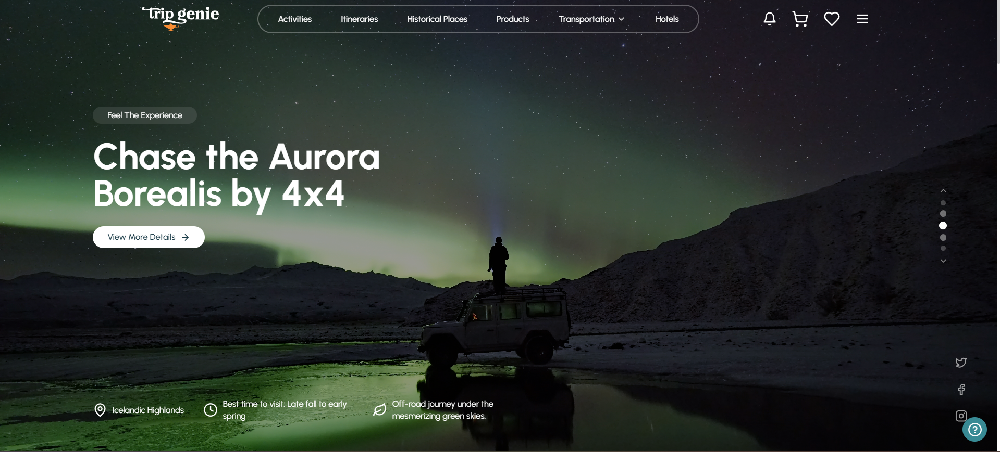
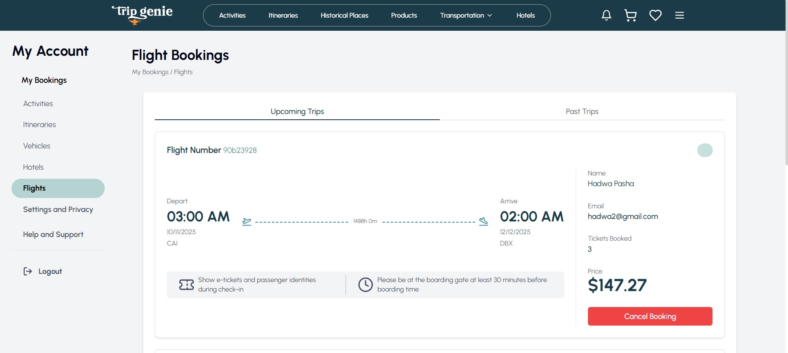
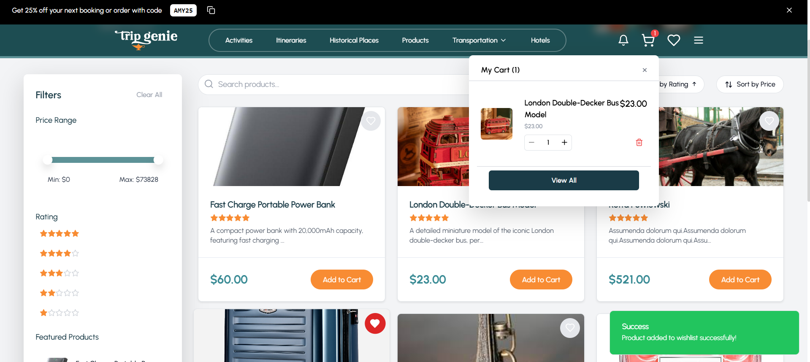
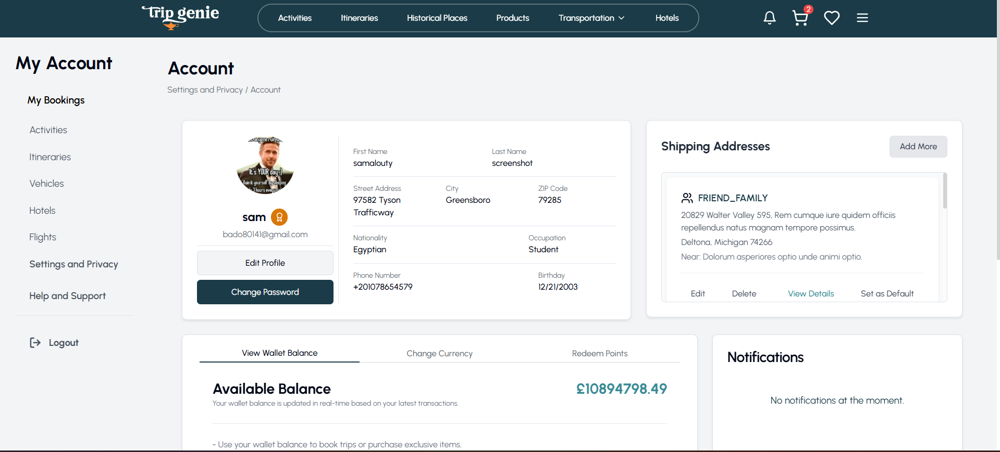

# Trip Genie 🧞‍♂️

A comprehensive travel and tourism platform that enables users to book flights, hotels, transportation, activities, and explore historical places while also providing a marketplace for travel-related products.

## Motivation

Trip Genie was created to revolutionize the travel planning experience by providing a one-stop solution for travelers. The platform bridges the gap between tourists, local guides, and businesses, making travel planning seamless and enriching.

## Build Status

- ✅ Development: Active
- 🚀 Current Version: 1.0.0
- 💻 Platform: Web Application

## Code Style

The project follows modern web development practices and conventions:

- React with JavaScript
- Tailwind CSS for styling
- ESLint + Prettier for code formatting
- Component-based architecture
- Role-based access control

## Screenshots









## Tech/Framework Used

### Built With
- React 18 with Vite
- JavaScript
- Tailwind CSS
- MongoDB
- Node.js
- Express.js

### Key Libraries
- js-cookie for authentication
- axios for API requests
- lucide-react for icons
- react-bootstrap for components
- cloudinary for image storing and uploading
- stripe for payment handling

## Features

### For Tourists
- Book flights, hotels, and transportation
- Explore and book activities and itineraries
- Visit historical places
- Shop travel-related products
- Loyalty points system
- Personalized recommendations

### For Tour Guides
- Create and manage itineraries
- Track bookings and revenue
- Manage profile and credentials
- Receive ratings and reviews

### For Sellers
- Product management
- Order processing
- Inventory tracking
- Sales analytics

### For Tourism Governors
- Manage historical places
- Create and manage tags
- Monitor tourism activities

## Installation

1. Clone the repository:
```bash
git clone https://github.com/Advanced-computer-lab-2024/Trip-Genie.git
```

2. Install dependencies:
```bash
cd TripGenie
cd frontend
npm install
cd ..
cd backend
npm install 
```

3. Set up environment variables:
```
MONGODB_URI= ...
JWT_SECRET= ...
STRIPE_KEY= ...
STRIPE_PRIVATE_KEY = ...
CLOUDINARY_API_KEY = ...
CLOUDINARY_API_SECRET = ...
VITE_AMADEUS_API_SECRET = ...
VITE_STRIPE_PUBLISHABLE_KEY = ...

```

4. Run the development server:
```bash
cd Trip-Genie/frontend
npm run dev
cd ../backend
npm run dev 
```

## API Reference
https://developers.amadeus.com/self-service/category/flights
https://docs.stripe.com/api
https://developers.booking.com/metasearch/connect-api


## Tests

Run the test suite:

```bash
cd backend
npm run test
```

## How to Use

1. Sign up for an account based on your role (Tourist, Tour Guide, Seller, etc.)
2. Complete your profile and verify your account
3. Explore the platform features based on your role:
   - Tourists can browse and book activities
   - Tour Guides can create itineraries
   - Sellers can list products
   - Tourism Governors can manage historical places

## Contribute

1. Fork the repository
2. Create your feature branch (`git checkout -b feature/AmazingFeature`)
3. Commit your changes (`git commit -m 'Add some AmazingFeature'`)
4. Push to the branch (`git push origin feature/AmazingFeature`)
5. Open a Pull Request

## Credits

- Design inspiration from modern travel platforms
- Icons from Lucide React
- UI Components from shadcn/ui
- Maps integration powered by Google Maps

## License

MIT License - see the [LICENSE.md](LICENSE.md) file for details
